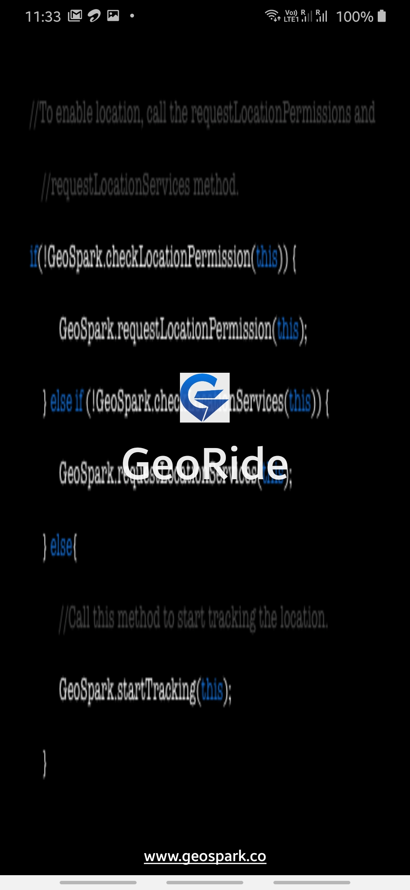
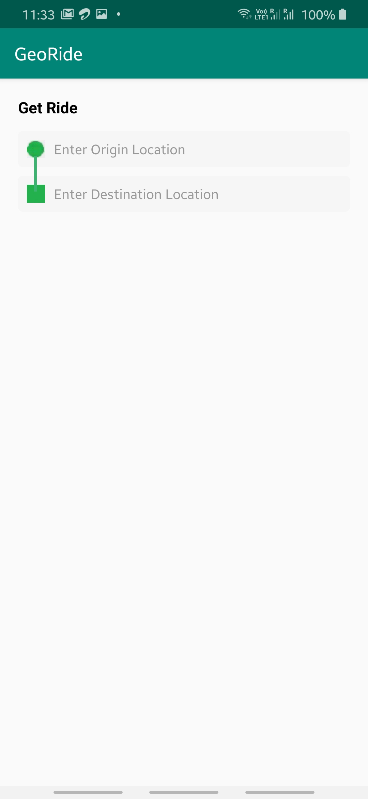

# GeoRide

The Following task is done:

>SplashScreen Activity with small Animation using GeoSparkLogo and Textview GeoRide

>After Animation it moves to GetRideActivty. As per the mock, design is made and using PlacePicker Location sdk we can select start and end Location 
